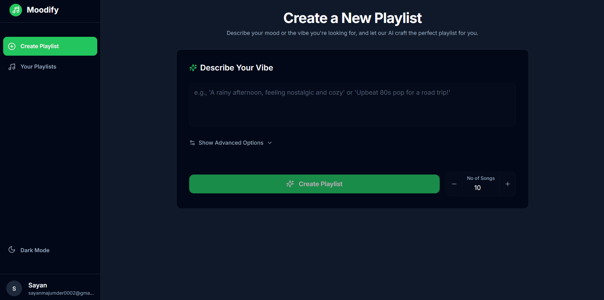

# Moodify - AI-Powered Playlist Generator

Moodify is a modern web application that creates personalized Spotify playlists based on your mood using AI. Simply describe how you're feeling, and let our AI create the perfect playlist for you.



## ✨ Features

- **🎯 Mood-Based Generation**: Create playlists based on your current mood or desired vibe
- **🤖 AI-Powered**: Uses Google's Gemini AI to understand your mood and suggest appropriate songs
- **🎨 Dark/Light Mode**: Beautiful, responsive UI with automatic dark mode support
- **🔄 Spotify Integration**: Seamlessly saves playlists to your Spotify account
- **📱 Responsive Design**: Works perfectly on desktop and mobile devices
- **🎵 Preview Songs**: Listen to song previews before saving the playlist
- **🎨 Customization**: Control playlist length and add custom descriptions

## 🚀 Tech Stack

- **Frontend**: Next.js 13+ (App Router), React, TypeScript
- **Styling**: Tailwind CSS
- **Authentication**: NextAuth.js with Spotify OAuth
- **Database**: PostgreSQL with Prisma ORM
- **AI**: Google Gemini API
- **API**: Spotify Web API
- **Hosting**: Vercel

## 📦 Installation

1. **Clone the repository**
   ```bash
   git clone https://github.com/yourusername/moodify.git
   cd moodify
   ```

2. **Install dependencies**
   ```bash
   npm install
   ```

3. **Set up environment variables**
   Create a `.env` file in the root directory with:
   ```env
   # Spotify API
   SPOTIFY_CLIENT_ID=your_spotify_client_id
   SPOTIFY_CLIENT_SECRET=your_spotify_client_secret

   # NextAuth
   NEXTAUTH_SECRET=your_nextauth_secret
   NEXTAUTH_URL=http://localhost:3000

   # Database
   DATABASE_URL=your_postgresql_url

   # Gemini AI
   GEMINI_API_KEY=your_gemini_api_key
   ```

4. **Set up the database**
   ```bash
   npx prisma migrate dev
   ```

5. **Run the development server**
   ```bash
   npm run dev
   ```

## 💻 Usage

1. **Login with Spotify**
   - Click "Login with Spotify" to authenticate
   - Grant necessary permissions for playlist creation

2. **Create a Playlist**
   - Describe your current mood or desired vibe
   - Add optional details like description and number of songs
   - Click "Create Playlist" to generate

3. **Customize & Save**
   - Preview the generated songs
   - Remove any songs you don't like
   - Save the playlist to your Spotify account

4. **Manage Playlists**
   - View all your generated playlists
   - Open them directly in Spotify
   - Delete individual songs or entire playlists

## 🔑 Environment Variables

| Variable | Description |
|----------|-------------|
| `SPOTIFY_CLIENT_ID` | Your Spotify application client ID |
| `SPOTIFY_CLIENT_SECRET` | Your Spotify application client secret |
| `NEXTAUTH_SECRET` | Random string for session encryption |
| `NEXTAUTH_URL` | Your application's base URL |
| `DATABASE_URL` | PostgreSQL connection string |
| `GEMINI_API_KEY` | Google Gemini API key |

## 📁 Project Structure

```
moodify/
├── src/
│   ├── app/                 # Next.js app router pages
│   ├── components/          # React components
│   ├── prisma/             # Database schema and migrations
│   └── types/              # TypeScript type definitions
├── public/                 # Static assets
└── package.json           # Project dependencies
```

## 🛠️ Development

- **Code Style**: Uses ESLint and Prettier
- **Type Safety**: Full TypeScript support
- **Database**: Prisma for type-safe database access
- **API Routes**: Next.js API routes with proper error handling
- **State Management**: React hooks for local state
- **Authentication**: NextAuth.js with JWT strategy

## 🤝 Contributing

1. Fork the repository
2. Create your feature branch (`git checkout -b feature/AmazingFeature`)
3. Commit your changes (`git commit -m 'Add some AmazingFeature'`)
4. Push to the branch (`git push origin feature/AmazingFeature`)
5. Open a Pull Request

## 📄 License

This project is licensed under the MIT License - see the [LICENSE](LICENSE) file for details.

## 🙏 Acknowledgments

- [Spotify Web API](https://developer.spotify.com/documentation/web-api/)
- [Google Gemini AI](https://deepmind.google/technologies/gemini/)
- [Next.js](https://nextjs.org/)
- [Tailwind CSS](https://tailwindcss.com/)
- [NextAuth.js](https://next-auth.js.org/)
- [Prisma](https://www.prisma.io/)
