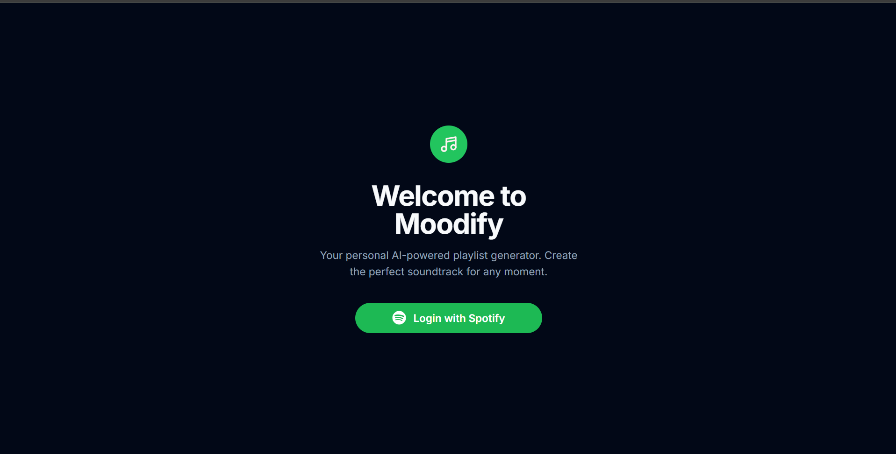

# Moodify - AI-Powered Playlist Generator

Moodify is an intelligent playlist generator that creates personalized Spotify playlists based on your mood and vibe descriptions. Using AI, it understands your musical preferences and crafts the perfect soundtrack for any moment.

## Features

- 🎵 AI-powered playlist generation
- 🎨 Beautiful, responsive UI with dark mode support
- 🔒 Secure Spotify authentication
- 🎧 Built-in music player with visualizations
- 💾 Save playlists directly to your Spotify account
- 📱 Mobile-friendly design

## Screenshots

### Login Page

*Welcome screen with animated audio wave visualization*

### Dashboard

*Create playlist page with mood input and advanced options*

## Tech Stack

- **Frontend**: Next.js 13, React, TypeScript, TailwindCSS
- **Authentication**: NextAuth.js with Spotify OAuth
- **Database**: PostgreSQL with Prisma ORM
- **AI Integration**: Google's Gemini AI
- **APIs**: Spotify Web API, Web Playback SDK

## Getting Started

1. Clone the repository
```bash
git clone https://github.com/sayan404/moodify.git
cd moodify
```

2. Install dependencies
```bash
npm install
```

3. Set up environment variables
```env
SPOTIFY_CLIENT_ID=your_spotify_client_id
SPOTIFY_CLIENT_SECRET=your_spotify_client_secret
NEXTAUTH_SECRET=your_nextauth_secret
NEXTAUTH_URL=http://localhost:3000
DATABASE_URL=your_postgresql_database_url
GEMINI_API_KEY=your_gemini_api_key
```

4. Run database migrations
```bash
npx prisma migrate dev
```

5. Start the development server
```bash
npm run dev
```

## Features in Detail

### AI Playlist Generation
- Natural language mood descriptions
- Genre awareness
- Tempo and energy matching
- Smart song selection

### Spotify Integration
- Full playlist management
- Real-time playback
- Save to your library
- Premium features support

### User Experience
- Animated audio visualizations
- Responsive design
- Dark/Light mode
- Intuitive interface

## Contributing

Contributions are welcome! Please feel free to submit a Pull Request.

## Support

If you like this project, consider [buying me a coffee](https://coff.ee/sayan404) ☕

## License

This project is licensed under the MIT License - see the [LICENSE](LICENSE) file for details.

## Author

- **Sayan Majumder**
- GitHub: [@sayan404](https://github.com/sayan404)
- LinkedIn: [Sayan404](https://linkedin.com/in/sayan404)

---

<div align="center">
Made with ❤️ by Sayan Majumder
</div>
